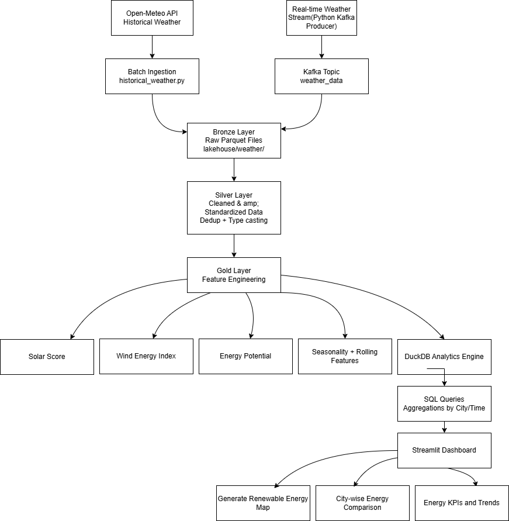
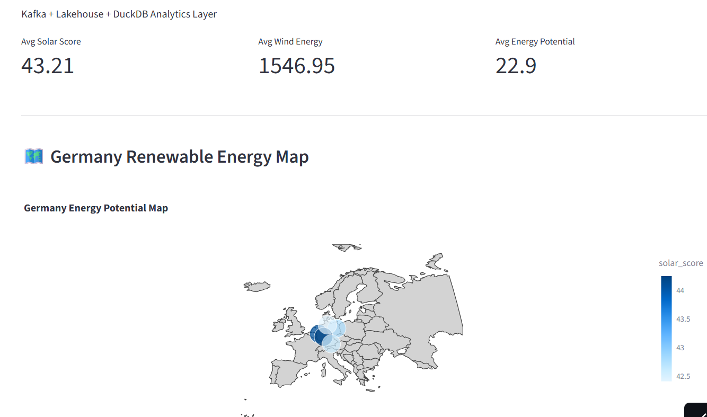
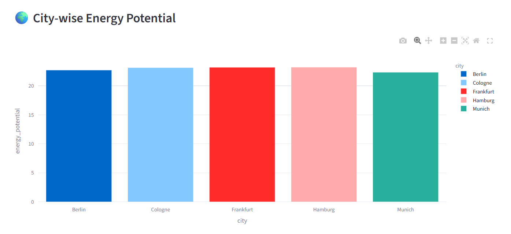
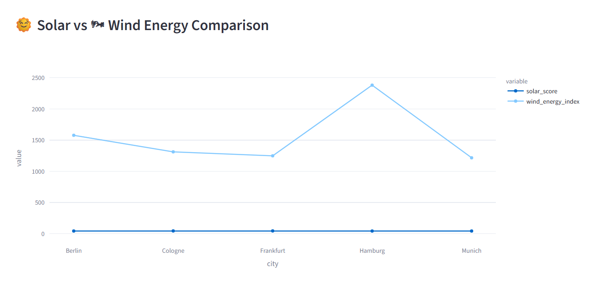
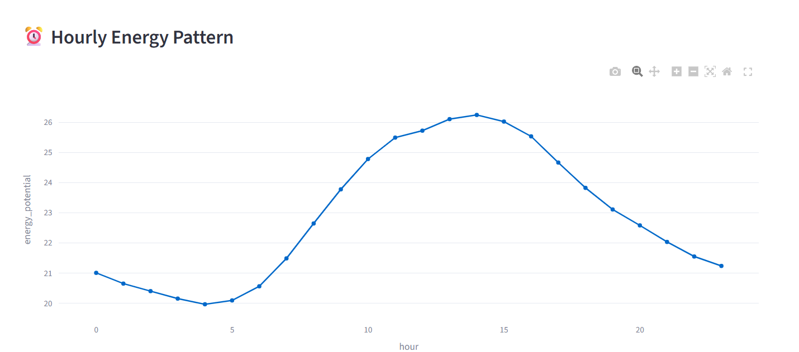
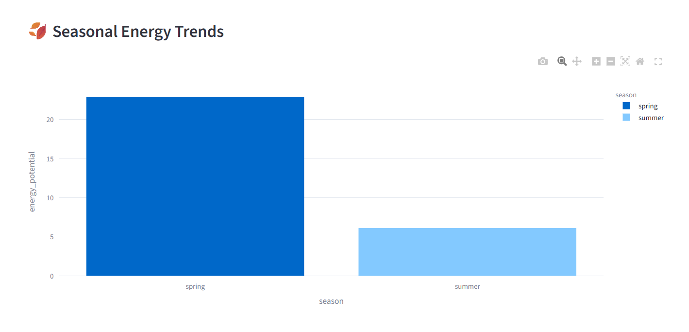

# 🌍 Renewable Energy Data Engineering Platform

An end-to-end data engineering project simulating a renewable energy intelligence system using weather data, streaming pipelines, and analytics dashboards.

---

# Renewable Energy Data Engineering Platform

## 🌐 Live Demo

https://renewable-energy-platform-svbmhnitvhsdpkxo4j3m25.streamlit.app/

(Screenshots attached at the last)

## 🚀 Project Overview

This project builds a modern **lakehouse architecture pipeline** that:

- Ingests real-time weather data (Kafka)
- Loads historical weather data (Open-Meteo API)
- Stores raw data in a lakehouse (Parquet)
- Processes data into Silver and Gold layers
- Performs feature engineering for energy insights
- Visualizes results in a Streamlit dashboard

---

## 🏗️ Architecture

This project follows a **Medallion-style Lakehouse Architecture** combined with **streaming ingestion via Kafka** and batch processing.

API + Kafka → Bronze → Silver → Gold → DuckDB → Streamlit Dashboard

```mermaid 


I designed a medallion architecture with Kafka ingestion, lakehouse storage in bronze-silver-gold layers, and DuckDB analytics powering a Streamlit geospatial dashboard.

---

## 📦 Features

- 🌦️ Weather data ingestion (real-time + historical)
- 📊 Lakehouse architecture (Bronze/Silver/Gold)
- ⚡ Energy feature engineering
- 🗺️ Germany geospatial visualization
- 🏆 City ranking system
- 📈 Analytics using DuckDB SQL

---

## 🧠 Key Metrics

- Solar Score
- Wind Energy Index
- Energy Potential
- Seasonal Trends

---

## 🛠️ Tech Stack

- Python
- Pandas
- Kafka
- DuckDB
- Streamlit
- Parquet (PyArrow)
- Open-Meteo API

---

## 📁 Project Structure
renewable-energy-platform/
│
├── ingestion/
├── transformations/
├── lakehouse/
│ ├── weather/
│ ├── silver/
│ └── gold/
├── dashboard/
├── docker/
└── README.md


## ▶️ How to Run

**1. Install Dependencies**

```bash
pip install -r requirements.txt

**2. Start Kafka (Docker)**

docker compose -f docker/kafka-compose.yml up -d

**3. Run ingestion**

python ingestion/historical_weather.py
python ingestion/kafka_to_lakehouse.py

**4. Run transformations**

python transformations/silver_weather.py
python transformations/gold_weather.py

**5. Start dashboard**

python -m streamlit run dashboard/app.py

**🗺️ Dashboard Features**
City comparison
Energy ranking
Interactive filters
Germany map visualization
📌 Author

Built as a Data Engineering portfolio project showcasing:

Streaming pipelines
Lakehouse architecture
Real-world analytics

📜 License

Free to use for learning and portfolio purposes.


##SCREENSHOTS









